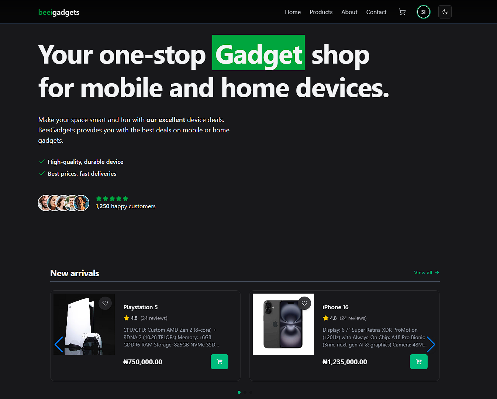
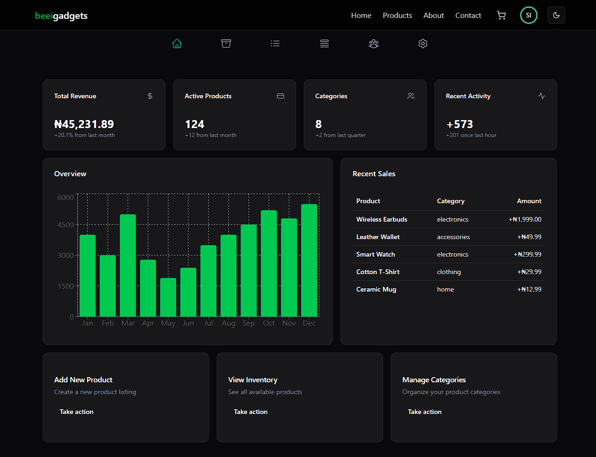
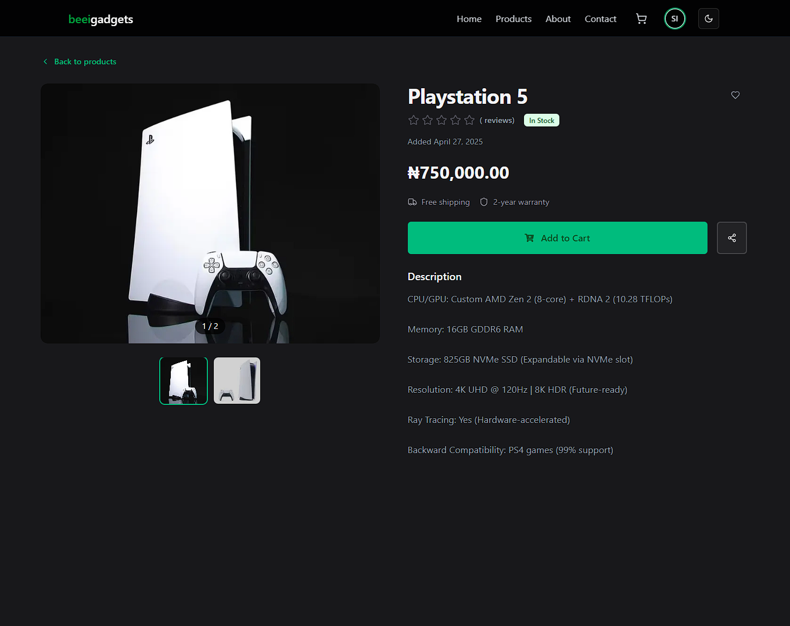
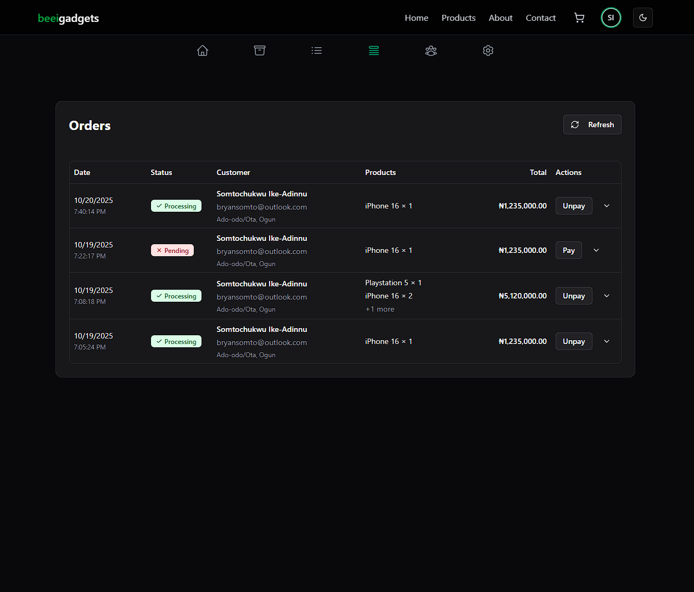

# 🛍️ Beei Gadgets Store


---

An **elegant, full-stack e-commerce store for mobile and home gadgets** built with **Next.js**, **TypeScript**, and **MongoDB**, featuring authentication, user profiles, **Paystack payments**, and a full **admin dashboard** for product and order management.

---

## 🖼️ Screenshots

<div align="center">

| Customer View                                                           | Admin Dashboard                                                         |
| ----------------------------------------------------------------------- | ----------------------------------------------------------------------- |
|                |  |
|  |         |

</div>

---

## 📘 Table of Contents

- [Overview](#-overview)
- [Features](#-features)
- [Tech Stack](#️-tech-stack)
- [Project Structure](#-project-structure)
- [Installation & Setup](#️-installation--setup)
- [Testing](#-testing)
- [Contributors](#-contributors)
- [License](#-license)

---

## 🚀 Overview

Beei Gadgets Store is a production-grade e-commerce web app that demonstrates **robust full-stack architecture** using **Next.js 14**, **NextAuth**, and **Paystack** integration.  
It includes both **customer-facing** and **admin-only** experiences — from product browsing to secure checkout and order tracking.

---

## 🧩 Features

### 🛒 Customer

- Account creation, login, and profile management
- Browse, search, and filter gadgets
- Add to cart, update quantity, and checkout securely
- Pay via **Paystack** integration
- View order history and track order status
- Fully responsive mobile-first design

### 🧑‍💼 Admin

- Role-based authentication & authorization
- Add, edit, and delete products or categories
- Manage product images and properties
- View and update customer orders
- Dashboard analytics and summary metrics

---

## 🛠️ Tech Stack

| Layer            | Technology                                   |
| ---------------- | -------------------------------------------- |
| Framework        | **Next.js (App Router)**                     |
| Language         | **TypeScript**                               |
| Styling          | **Tailwind CSS + ShadCN UI**                 |
| Database         | **MongoDB + Mongoose**                       |
| Authentication   | **NextAuth.js (Credentials & Google OAuth)** |
| Payment Gateway  | **Paystack API**                             |
| Validation       | **Zod**                                      |
| Forms            | **React Hook Form**                          |
| Alerts           | **SweetAlert2**                              |
| State Management | **React Context + useReducer**               |
| Deployment       | **Vercel**                                   |
| Testing          | **Jest**                                     |
| Linting          | **ESLint**                                   |

---

## 📂 Project Structure

```
beei-gadgets-store/
├── app/ # Next.js App Router pages & layouts
├── components/ # Reusable UI components
├── context/ # Global state providers (cart, user, etc.)
├── lib/ # Utilities (db, auth, Paystack, etc.)
├── models/ # Mongoose schemas (User, Product, Order)
├── public/ # Static assets & screenshots
├── types/ # TypeScript types & interfaces
├── package.json
├── tsconfig.json
├──next.config.ts
└── README.md
```

---

## ⚙️ Installation & Setup

1. **Clone the repository**

   ```bash
   git clone https://github.com/bryansomto/beei-gadgets-store.git
   cd beei-gadgets-store
   ```

2. **Install dependencies**

   ```bash
   pnpm install
   ```

3. **Create `.env.local` file**

   ```env
   AUTH_SECRET=your_auth_secret
   AUTH_GOOGLE_ID=your_google_client_id
   AUTH_GOOGLE_SECRET=your_google_client_secret
   MONGODB_URI=your_mongodb_connection_string
   NEXT_PUBLIC_API_URL=http://localhost:3000
   NEXT_PUBLIC_ADMIN_EMAILS=admin@example.com
   db_password=your_database_password
   NEXTAUTH_DEBUG=true
   S3_ACCESS_KEY=your_s3_access_key
   S3_SECRET_ACCESS_KEY=your_s3_secret_key
   S3_REGION=your_s3_region
   S3_BUCKET_NAME=your_bucket_name
   PAYSTACK_SECRET_KEY=your_paystack_secret_key
   NEXT_PUBLIC_PAYSTACK_PUBLIC_KEY=your_paystack_public_key
   PASSWORD_PEPPER=your_password_pepper
   NODE_ENV=development
   EMAIL_USE_TEST_DOMAIN=true
   RESEND_API_KEY=your_resend_api_key

   ```

4. **Run the development server**

   ```bash
   pnpm dev
   ```

   Then open [http://localhost:3000](http://localhost:3000) in your browser.

---

## 🧪 Testing

```bash
pnpm test
```

---

## 🧑‍🤝‍🧑 Contributors

- [@bryansomto](https://github.com/bryansomto) — Developer & Maintainer  
  [](https://www.linkedin.com/in/bryansomto)

---

## 📜 License

This project is licensed under the **MIT License**.  
See the [LICENSE](./LICENSE) file for more details.
